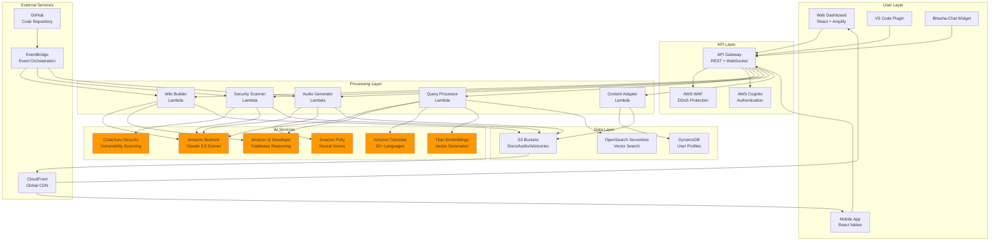
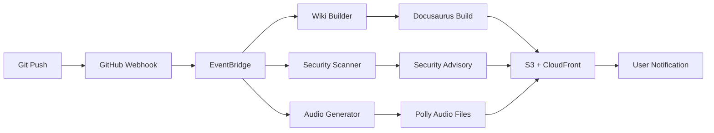
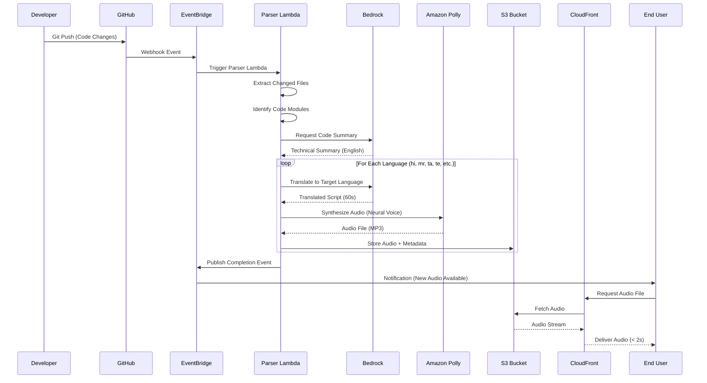
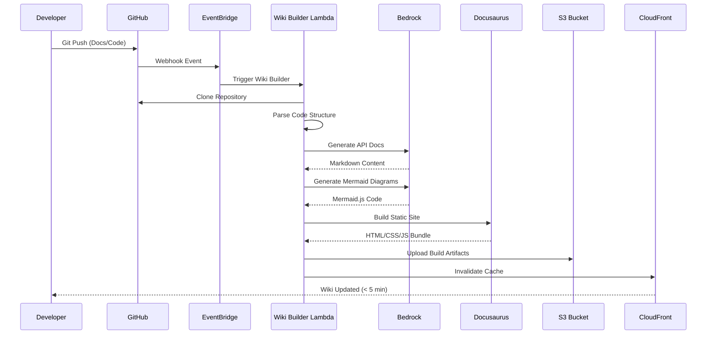
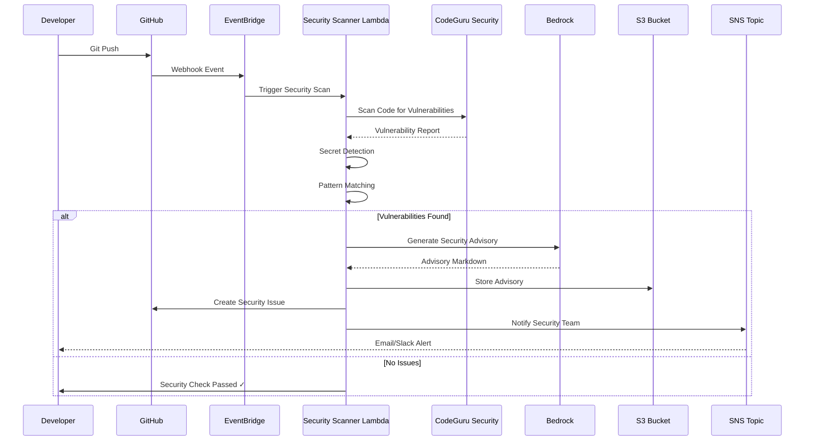
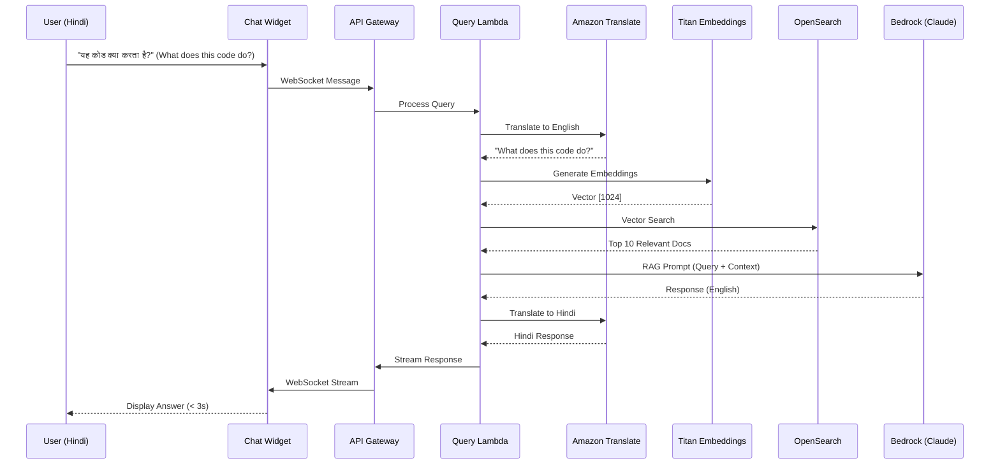
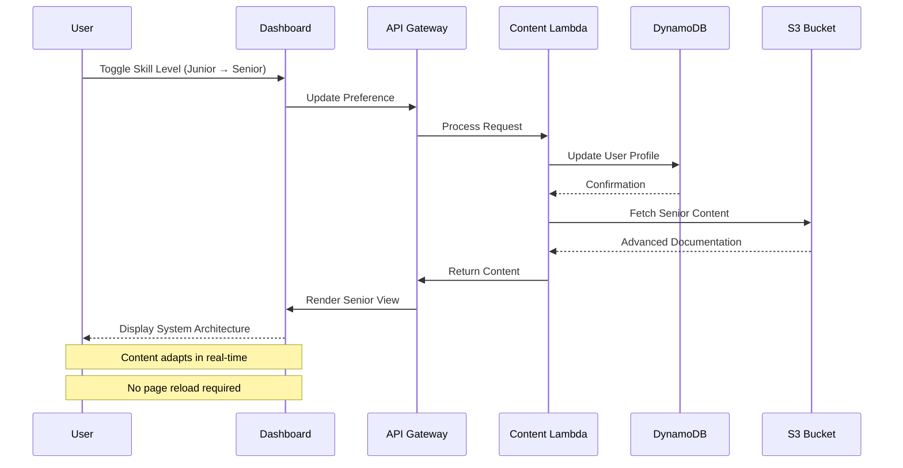
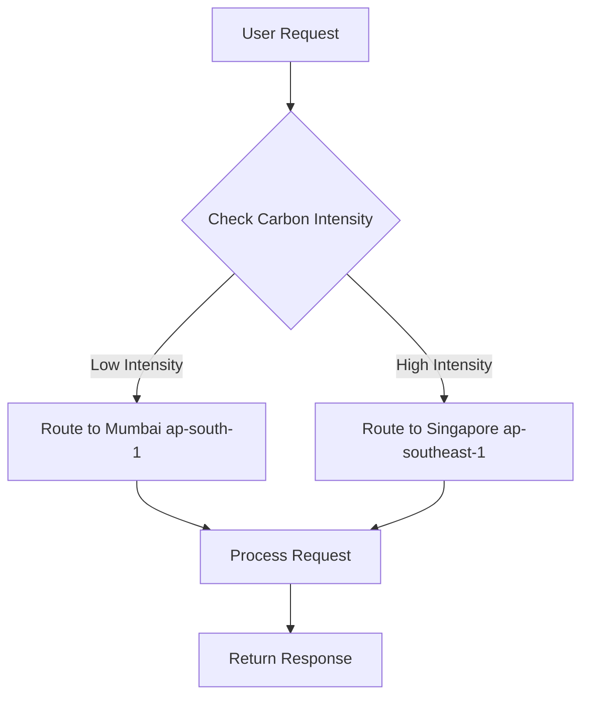

# System Design: Synthetix Docs - AI-Augmented Technical Navigator for Bharat

## Architecture Overview

### High-Level Architecture

The system follows a serverless, event-driven architecture on AWS, leveraging Amazon Bedrock for AI capabilities. The architecture is designed for scalability, low latency, and cost efficiency.

**Key Layers:**
1. User Interface Layer (Web, Mobile, IDE)
2. API Gateway Layer (Authentication, Rate Limiting)
3. Orchestration Layer (Multi-Agent System)
4. Processing Layer (Lambda Functions)
5. Data Layer (OpenSearch, DynamoDB, S3)
6. Foundation Model Layer (Amazon Bedrock)

### System Architecture Diagram (Mermaid.js)



### Event-Driven Architecture Flow



### AWS Services Integration Map

**Core Services:**
- **Compute:** Lambda (serverless functions)
- **AI/ML:** Bedrock, Amazon Q Developer, Polly, Translate, CodeGuru
- **Storage:** S3, DynamoDB, OpenSearch
- **Networking:** API Gateway, CloudFront, EventBridge
- **Security:** Cognito, WAF, KMS, Secrets Manager
- **Monitoring:** CloudWatch, X-Ray, Cost Explorer
- **Sustainability:** Customer Carbon Footprint Tool

## Component Design

### 1. Autonomous Wiki & Mapper

#### 1.1 Docusaurus Portal Generator

**Technology Stack:**
- Docusaurus 3.0+ for static site generation
- Markdown/MDX for content
- Algolia DocSearch for full-text search
- GitHub Actions for automated builds

**Architecture:**
```
Git Push → GitHub Webhook → EventBridge → Lambda (Parser)
  → Extract docs/code → Generate Markdown
  → Docusaurus Build → S3 Upload → CloudFront Invalidation
```

**Features:**
- Versioned documentation (v1, v2, latest)
- Auto-generated API references
- Code playground integration
- Dark/light theme support

#### 1.2 Mermaid.js Architecture Mapper

**Process:**
1. Code analysis using AST parsing
2. Dependency graph generation
3. Mermaid.js diagram synthesis
4. Interactive diagram rendering

**Diagram Types:**
- System architecture (C4 model)
- Sequence diagrams (function calls)
- Entity-relationship diagrams
- State machines

**Technical Implementation:**
- Lambda function for code analysis
- Amazon Bedrock for diagram generation
- Mermaid.js rendering in browser
- SVG export for documentation

### 2. The Bharat Explainer (Audio Walkthroughs)

#### 2.1 Audio Generation Pipeline

**Architecture:**
```
Code Module → Bedrock (Summarize) → Polly (Synthesize)
  → S3 (Store) → CloudFront (Deliver) → User
```

**Amazon Polly Configuration:**
- Engine: Neural
- Languages: hi-IN, mr-IN, ta-IN, te-IN, bn-IN, gu-IN, kn-IN, ml-IN, pa-IN
- Voice IDs: Aditi (Hindi), Kajal (Hindi), etc.
- Output format: MP3, 64 kbps
- Speech rate: 100% (adjustable by user)

**Content Generation:**
1. Extract code module/function
2. Analyze logic flow and dependencies
3. Generate 60-second script using Bedrock
4. Translate to target language
5. Synthesize audio with Polly
6. Store in S3 with metadata

**Caching Strategy:**
- Cache audio files for 30 days
- Regenerate on code changes
- Pre-generate for popular modules

#### 2.2 Audio Player Component

**Features:**
- Play/pause controls
- Speed adjustment (0.75x, 1x, 1.25x, 1.5x)
- Download for offline use
- Transcript display with highlighting
- Language selector

### 3. Bhasha-Chat (Multilingual RAG Widget)

#### 3.1 RAG Architecture

**Components:**
1. **Embedding Layer:** Amazon Titan Embeddings
2. **Vector Store:** Amazon OpenSearch Serverless
3. **Retrieval:** Hybrid search (keyword + semantic)
4. **Generation:** Amazon Bedrock (Claude 3.5 Sonnet)
5. **Translation:** Amazon Translate

**RAG Pipeline:**
```
User Query (Hindi)
  → Translate to English
  → Generate Embeddings
  → OpenSearch Vector Search (Top 10)
  → Rerank Results
  → Context Assembly
  → Bedrock Prompt (Query + Context)
  → Generate Response
  → Translate to Hindi
  → Stream to User
```

**Context Window Management:**
- Max context: 8,000 tokens
- Chunk size: 512 tokens
- Overlap: 50 tokens
- Reranking: Cross-encoder model

#### 3.2 Chat Widget Implementation

**Technology Stack:**
- React 18+ with TypeScript
- WebSocket for streaming
- Redux for state management
- Markdown rendering with syntax highlighting

**Features:**
- Collapsible sidebar widget
- Conversation history (last 10 messages)
- Code snippet copying
- Feedback buttons (helpful/not helpful)
- Language switcher
- Voice input (optional)

**Embedding:**
```html
<script src="https://cdn.synthetix-docs.ai/bhasha-chat.js"></script>
<script>
  BhashaChat.init({
    apiKey: 'YOUR_API_KEY',
    language: 'hi',
    theme: 'light'
  });
</script>
```

### 4. Suraksha-Audit (Security Scanner)

#### 4.1 Security Scanning Pipeline

**Architecture:**
```
Git Push → EventBridge → Lambda (Scanner)
  ├─ CodeGuru Security Scan
  ├─ Secret Detection
  ├─ Custom Pattern Matching
  └─ Vulnerability Database Lookup
  → Generate Advisory → Store in S3
  → Update Wiki → Notify Team
```

**Scanning Engines:**

**1. Amazon CodeGuru Security:**
- OWASP Top 10 detection
- CWE (Common Weakness Enumeration)
- Crypto vulnerabilities
- Injection flaws

**2. Secret Scanner:**
- AWS credentials
- API keys (GitHub, Stripe, etc.)
- Private keys (RSA, SSH)
- Database connection strings
- JWT tokens

**3. Custom Patterns:**
- Hardcoded passwords
- Insecure random number generation
- Weak cryptographic algorithms
- Unvalidated redirects

#### 4.2 Security Advisory Generation

**Advisory Format:**
```markdown
# Security Advisory: [VULN-ID]

## Severity: [Critical/High/Medium/Low]

## Description
[Detailed vulnerability description]

## Affected Files
- file1.sol:123
- file2.js:456

## Remediation
[Step-by-step fix instructions]

## Code Example
[Before/After code snippets]

## References
- CWE-XXX
- OWASP Link
```

**Storage:**
- S3: /security-advisories/VULN-{timestamp}.md
- DynamoDB: Vulnerability tracking table
- GitHub: Security Advisory API

**Notification:**
- Email to security team
- Slack/Discord webhook
- GitHub issue creation
- Dashboard alert

### 5. Skill-Adaptive Content System

#### 5.1 Content Versioning

**Content Levels:**

**Junior Level:**
- Step-by-step explanations
- Visual diagrams and flowcharts
- Code walkthroughs with comments
- Glossary of terms
- Related learning resources

**Senior Level:**
- High-level architecture overview
- Design patterns and trade-offs
- Performance considerations
- Scalability implications
- Advanced use cases

**Storage Structure:**
```
/docs/
  /junior/
    concept-a.md
    concept-b.md
  /senior/
    concept-a.md
    concept-b.md
```

#### 5.2 Adaptive Content Engine

**Skill Detection Algorithm:**
1. Initial assessment quiz (optional)
2. Interaction pattern analysis
3. Query complexity scoring
4. Time spent on content
5. Feedback signals

**Scoring Metrics:**
- Query sophistication: 0-100
- Code complexity preference: 0-100
- Documentation depth: 0-100
- Overall skill level: Beginner/Intermediate/Advanced

**Dynamic Adjustment:**
- Real-time content switching
- Smooth transitions (fade in/out)
- Persistent user preference
- Override toggle for manual control

### 6. User Interface Layer

#### 6.1 Web Application

**Technology Stack:**
- Frontend: React.js 18+ with TypeScript
- State Management: Redux Toolkit
- UI Framework: Material-UI (MUI)
- Real-time: WebSocket for streaming responses
- Internationalization: i18next

**Key Features:**
- Responsive design
- Dark/light mode
- Code syntax highlighting
- Interactive diagrams
- Voice input support
- Skill level toggle
- Audio player integration

#### 6.2 React Dashboard

**AWS Amplify Hosting:**
- Continuous deployment from GitHub
- Custom domain with SSL
- Global CDN distribution
- Environment variables management

**Dashboard Sections:**
1. **Home:** Quick search, recent queries
2. **Documentation:** Docusaurus portal iframe
3. **Architecture:** Interactive Mermaid diagrams
4. **Audio Tours:** Browse by module/language
5. **Security:** Vulnerability dashboard
6. **Learning Path:** Personalized curriculum
7. **Settings:** Language, skill level, preferences

#### 6.3 Mobile Application

**Technology Stack:**
- React Native with TypeScript
- Redux Toolkit for state
- Offline support with AsyncStorage

**Platform Support:**
- iOS 14+
- Android 8.0+

#### 6.4 IDE Plugin (VS Code)

**Features:**
- Inline documentation lookup
- Code explanation on hover
- Quick search command
- Sidebar chat interface
- Audio playback in editor

### 7. API Gateway Layer

#### 7.1 REST API Endpoints

**Core Endpoints:**
- POST /api/v1/query - Submit technical query
- POST /api/v1/onboarding - Generate learning path
- POST /api/v1/code/explain - Get code explanation
- GET /api/v1/governance/sips - Retrieve SIP/SCCP info
- POST /api/v1/audio/generate - Generate audio walkthrough
- GET /api/v1/audio/{id} - Retrieve audio file
- GET /api/v1/security/advisories - List security advisories
- POST /api/v1/wiki/build - Trigger wiki rebuild
- GET /api/v1/diagrams/{module} - Get architecture diagram

**WebSocket:**
- /ws/stream - Real-time streaming responses
- /ws/chat - Bhasha-Chat widget connection

**Authentication:**
- AWS Cognito User Pools
- JWT token-based auth
- OAuth 2.0 for GitHub/GitLab

**Rate Limiting:**
- Free tier: 100 requests/minute
- Premium: 1000 requests/minute
- Burst capacity: 200 requests

### 8. Orchestration Layer

#### 8.1 Multi-Agent System

**Scanner Agent:**
- Extract technical elements from docs
- Identify code snippets and references
- Parse SIPs/SCCPs
- Detect documentation structure

**Verification Agent:**
- Cross-reference against authoritative sources
- Validate code examples
- Check for outdated information
- Assign confidence scores

**Synthesis Agent:**
- Generate natural language responses
- Translate to regional languages
- Personalize based on user profile
- Format output with highlighting

**Orchestration Flow:**
```
User Query → Scanner → Verification → Synthesis → Response
```

### 9. Processing Layer

#### 9.1 Query Processor (Lambda)

**Configuration:**
- Runtime: Python 3.12
- Memory: 2048 MB
- Timeout: 30 seconds

**Logic:**
1. Parse incoming query
2. Detect language and intent
3. Generate embeddings
4. Semantic search in OpenSearch
5. Invoke Bedrock Agents
6. Store interaction history
7. Return formatted response

#### 9.2 Document Ingestion Pipeline

**Trigger:** S3 Event (new document upload)

**Process:**
1. Extract document from S3
2. Parse and chunk document (512 tokens)
3. Generate embeddings
4. Store in OpenSearch
5. Update metadata in DynamoDB
6. Trigger reindexing if needed

**Capacity:** 500,000 documents/month

#### 9.3 Learning Path Generator

**Process:**
1. Assess user skill level
2. Identify knowledge gaps
3. Generate personalized curriculum
4. Create milestone tracking
5. Store learning path

### 10. Data Layer

#### 10.1 Amazon OpenSearch Serverless

**Index Schema:**
- document_id (keyword)
- title (text)
- content (text)
- content_vector (knn_vector, dimension: 1024)
- language (keyword)
- category (keyword)
- tags (keyword)
- timestamps (date)
- confidence_score (float)

**Search Strategy:**
- Hybrid: Keyword + semantic vector search
- Boosting: Recent documents weighted higher
- Filtering: By language, category, confidence
- Pagination: 20 results per page

#### 10.2 Amazon DynamoDB

**Tables:**

**UserProfiles:**
- Partition Key: userId
- Attributes: email, language, skillLevel, preferences
- GSI: EmailIndex

**InteractionHistory:**
- Partition Key: userId
- Sort Key: timestamp
- TTL enabled for data retention

**LearningPaths:**
- Partition Key: pathId
- GSI: UserIdIndex

**Billing:** PAY_PER_REQUEST mode

#### 10.3 Amazon S3

**Bucket Structure:**
```
synthetix-docs-bucket/
├── raw-documents/
├── processed-documents/
├── governance/
├── code-repositories/
├── user-uploads/
├── audio-walkthroughs/
│   ├── hi/  (Hindi)
│   ├── mr/  (Marathi)
│   ├── ta/  (Tamil)
│   └── te/  (Telugu)
├── security-advisories/
├── docusaurus-builds/
└── mermaid-diagrams/
```

**Lifecycle Policies:**
- Raw docs: Glacier after 90 days
- Processed: Standard storage
- User uploads: Delete after 30 days
- Audio files: Standard-IA after 60 days
- Security advisories: Retain indefinitely

### 11. Foundation Model Layer

#### 11.1 Amazon Bedrock

**Claude 3.5 Sonnet:**
- Model ID: anthropic.claude-3-5-sonnet-20241022-v2:0
- Max tokens: 4096
- Temperature: 0.7
- Top P: 0.9

**Titan Multimodal Embeddings:**
- Model ID: amazon.titan-embed-text-v2:0
- Dimensions: 1024
- Normalized: True

## Data Flow Diagrams

### Query Processing Flow

```
User Query (Hindi)
  → API Gateway (Auth)
  → Query Processor Lambda
  → Language Detection
  → Generate Embeddings (Titan)
  → OpenSearch Vector Search
  → Retrieve Top 10 Documents
  → Bedrock Agents Orchestration
    ├─ Scanner: Extract sections
    ├─ Verification: Validate
    └─ Synthesis: Translate to Hindi
  → Format Response
  → Store Interaction (DynamoDB)
  → Return to User (< 3 seconds)
```

### Document Ingestion Flow

```
GitHub Webhook (New SIP)
  → S3 Upload
  → EventBridge Trigger
  → Document Ingestion Lambda
  → Parse Markdown
  → Chunk Document
  → Generate Embeddings
  → Index in OpenSearch
  → Update Metadata
  → Notify Subscribers
```

### Onboarding Flow

```
New User Registration
  → Create Profile (DynamoDB)
  → Initial Skill Assessment
  → Learning Path Generator
  → Analyze Knowledge Gaps
  → Generate Curriculum
  → Create Milestones
  → Store Learning Path
  → Send Welcome Email
  → Display Dashboard
```

### Git Push → Audio Generation Pipeline (Mermaid.js)



### Autonomous Wiki Generation Pipeline (Mermaid.js)



### Security Audit Pipeline (Mermaid.js)



### Bhasha-Chat RAG Flow (Mermaid.js)



### Skill-Adaptive Content Delivery (Mermaid.js)



## Security Architecture

### Authentication & Authorization

**AWS Cognito:**
- Email/password authentication
- Multi-factor authentication (MFA)
- Social identity providers
- Custom user attributes

**IAM Roles:**
- LambdaExecutionRole: DynamoDB, S3, OpenSearch, Bedrock access
- APIGatewayRole: Lambda invoke, CloudWatch logs

### Data Encryption

**In Transit:**
- TLS 1.3 for all API communications
- WebSocket Secure (WSS)

**At Rest:**
- S3: Server-side encryption with KMS
- DynamoDB: Encryption enabled
- OpenSearch: Encryption enabled
- Secrets Manager for credentials

### Network Security

**VPC Configuration:**
- Private subnets for Lambda
- VPC endpoints for AWS services
- Security groups with least privilege
- Network ACLs

**API Gateway:**
- AWS WAF for DDoS protection
- Request throttling
- IP whitelisting for admin
- CORS configuration

## Monitoring & Observability

### CloudWatch Metrics

**Custom Metrics:**
- Query response time (p50, p95, p99)
- Embedding generation latency
- OpenSearch query performance
- Bedrock API latency
- Error rates by endpoint
- User satisfaction scores

**Alarms:**
- Response time > 5 seconds
- Error rate > 1%
- OpenSearch cluster health
- Lambda concurrent executions > 80%
- DynamoDB throttling

### Logging Strategy

**CloudWatch Logs:**
- Structured JSON logging
- Request ID tracking
- User ID tracking
- Performance metrics
- Error details

**Retention:**
- Application logs: 30 days
- Audit logs: 1 year
- Error logs: 90 days

### Distributed Tracing

**AWS X-Ray:**
- End-to-end request tracing
- Service map visualization
- Performance bottleneck identification
- Error analysis

## Deployment Architecture

### Multi-Region Strategy

**Primary:** ap-south-1 (Mumbai)
**Secondary:** ap-southeast-1 (Singapore)

**Replication:**
- S3: Cross-region replication
- DynamoDB: Global tables
- OpenSearch: Cross-cluster replication
- CloudFront: Global CDN

### CI/CD Pipeline

**Tools:**
- GitHub Actions for CI/CD
- AWS CodePipeline
- AWS CodeBuild
- AWS CodeDeploy

**Stages:**
1. Source (GitHub trigger)
2. Build (dependencies, tests, packages)
3. Test (integration, security, performance)
4. Deploy (staging → approval → production)
5. Monitor (alarms, tracing, feedback)

### Infrastructure as Code

**AWS CDK (TypeScript):**
- API Gateway configuration
- Lambda functions
- DynamoDB tables
- OpenSearch collections
- IAM roles and policies
- CloudWatch alarms

## Cost Optimization

### Estimated Monthly Costs (Updated with New Features)

**Compute:**
- Lambda (Query, Parser, Wiki Builder, Security Scanner): $3,500
- Bedrock (Claude 3.5 Sonnet for RAG, Summaries, Diagrams): $14,000
- CodeGuru Security (Scans): $500

**AI Services:**
- Amazon Polly (Audio Generation - 10 languages): $1,200
- Amazon Translate (Multilingual Support): $800
- Titan Embeddings: $1,000

**Storage:**
- S3 (Docs, Audio, Advisories, Docusaurus Builds): $800
- DynamoDB (User Profiles, Interaction History): $1,200
- OpenSearch Serverless (Vector Search): $2,500

**Networking:**
- API Gateway: $600
- CloudFront (Global CDN for Wiki + Audio): $400
- Data Transfer: $300

**Hosting:**
- AWS Amplify (React Dashboard): $200

**Monitoring & Security:**
- CloudWatch (Logs, Metrics, Alarms): $300
- AWS WAF: $150
- AWS Customer Carbon Footprint Tool: $0 (Free)

**Total:** ~$27,450/month

**Cost per User (1000 active users):** $27.45/month

### Cost Breakdown by Feature

1. **Autonomous Wiki & Mapper:** $1,500/month
   - Lambda execution, S3 storage, CloudFront delivery

2. **Bharat Explainer (Audio):** $2,000/month
   - Polly synthesis, S3 storage, CloudFront streaming

3. **Bhasha-Chat (RAG):** $18,000/month
   - Bedrock inference, embeddings, OpenSearch, Translate

4. **Suraksha-Audit:** $1,200/month
   - CodeGuru scans, Lambda processing, notifications

5. **Skill-Adaptive Content:** $800/month
   - DynamoDB queries, S3 storage, Lambda processing

6. **Infrastructure & Monitoring:** $3,950/month
   - API Gateway, Amplify, CloudWatch, WAF

### Optimization Strategies

1. **Caching:** 
   - CloudFront edge caching (80% cache hit rate)
   - Lambda response caching (5-minute TTL)
   - Audio file caching (30-day TTL)
   - Reduce Bedrock calls by 60%

2. **Batching:** 
   - Document ingestion (batch of 100)
   - Embedding generation (batch of 50)
   - Audio generation (nightly batch for popular modules)

3. **Right-Sizing:** 
   - Lambda memory optimization (512MB → 1024MB for critical paths)
   - DynamoDB on-demand pricing for variable workloads
   - OpenSearch OCU optimization

4. **Reserved Capacity:** 
   - Savings Plans for predictable Bedrock usage (30% savings)
   - S3 Intelligent-Tiering for audio files

5. **Cost Monitoring:**
   - AWS Cost Explorer dashboards
   - Budget alerts at 80% threshold
   - Daily cost anomaly detection

### Projected Cost Reduction (6 months)

- **Month 1-2:** $27,450/month (baseline)
- **Month 3-4:** $22,000/month (caching optimizations)
- **Month 5-6:** $18,750/month (full optimization + Savings Plans)

**Target:** $18,750/month (32% reduction from baseline)

## Testing Strategy

### Test Types

**Unit Tests:**
- Lambda function logic
- Data transformations
- Coverage: 80%

**Integration Tests:**
- API endpoints
- Database operations
- External services
- Agent orchestration

**Performance Tests:**
- Load testing (10,000 concurrent users)
- Stress testing
- Endurance testing (24 hours)
- Spike testing

**Security Tests:**
- Penetration testing
- Vulnerability scanning
- Auth/authz testing
- Encryption validation

## Disaster Recovery

### Backup Strategy

**RTO:** 1 hour
**RPO:** 15 minutes

**Backups:**
- DynamoDB: Point-in-time recovery
- S3: Versioning enabled
- OpenSearch: Automated snapshots (4 hours)
- Lambda: Code in S3 with versioning

### Failover Procedures

1. **Regional Failover:** Route 53 health checks, automatic DNS failover
2. **Service Degradation:** Graceful degradation, cached responses, static fallbacks

## Accessibility Compliance

### WCAG 2.1 Level AA

**Requirements:**
- Keyboard navigation
- Screen reader compatibility
- Color contrast ≥ 4.5:1
- Text resizing up to 200%
- Alternative text for images
- ARIA labels

**Testing:**
- Automated: axe-core
- Manual: Screen readers
- User testing with experts

## Internationalization

### Supported Languages

**Phase 1:**
- English, Hindi, Marathi, Tamil, Telugu, Bengali

**Phase 2:**
- Gujarati, Kannada, Malayalam, Punjabi, Odia

### Translation Strategy

**Content Types:**
1. UI strings: Pre-translated JSON files
2. Documentation: On-demand via Bedrock
3. User content: Optional translation

**Quality Assurance:**
- Native speaker review
- Automated quality checks
- User feedback loop

## GreenOps & Sustainability

### AWS Customer Carbon Footprint Tool Integration

**Real-Time Tracking:**
- Carbon emissions per service (Lambda, Bedrock, S3, etc.)
- Regional carbon intensity monitoring
- Monthly carbon footprint reports
- Year-over-year comparison

**Dashboard Metrics:**
- Total CO2e (Carbon Dioxide Equivalent) emissions
- Emissions by service category
- Emissions by region
- Carbon efficiency (CO2e per 1000 requests)

### Carbon-Aware Architecture

**Regional Routing Strategy:**


**Optimization Techniques:**

1. **Intelligent Workload Scheduling:**
   - Schedule batch jobs (audio generation, wiki builds) during low-carbon hours
   - Use AWS Carbon Lake data for scheduling decisions
   - Prioritize regions with renewable energy

2. **Resource Efficiency:**
   - Right-size Lambda functions to minimize waste
   - Use ARM-based Graviton processors (20% more energy efficient)
   - Implement aggressive caching to reduce compute

3. **Storage Optimization:**
   - S3 Intelligent-Tiering for automatic lifecycle management
   - Compress audio files (MP3 64kbps vs 128kbps = 50% reduction)
   - Delete unused data automatically

4. **Multi-Region Strategy:**
   - Primary: ap-south-1 (Mumbai) - 40% renewable energy
   - Secondary: ap-southeast-1 (Singapore) - 30% renewable energy
   - Route based on carbon intensity + latency

### Sustainability Reporting

**Monthly GreenOps Report:**
```markdown
# Synthetix Docs - Carbon Footprint Report (February 2026)

## Summary
- Total Emissions: 1.2 metric tons CO2e
- Emissions per User: 1.2 kg CO2e
- Carbon Efficiency: 0.04 kg CO2e per 1000 requests
- Renewable Energy %: 38%

## Breakdown by Service
- Lambda: 0.4 tons (33%)
- Bedrock: 0.5 tons (42%)
- Storage (S3, DynamoDB): 0.2 tons (17%)
- Networking: 0.1 tons (8%)

## Optimizations Implemented
- Batch audio generation during low-carbon hours: -15% emissions
- ARM Graviton processors: -20% compute emissions
- Aggressive caching: -30% Bedrock calls

## Recommendations
- Increase renewable energy usage to 50%
- Implement carbon-aware load balancing
- Optimize Lambda cold starts
```

**API Endpoint:**
```
GET /api/v1/sustainability/report?month=2026-02
```

**Response:**
```json
{
  "period": "2026-02",
  "totalEmissions": 1.2,
  "emissionsPerUser": 1.2,
  "carbonEfficiency": 0.04,
  "renewableEnergyPercent": 38,
  "breakdown": {
    "lambda": 0.4,
    "bedrock": 0.5,
    "storage": 0.2,
    "networking": 0.1
  },
  "optimizations": [
    "Batch processing during low-carbon hours",
    "ARM Graviton processors",
    "Aggressive caching"
  ]
}
```

### Carbon Reduction Goals

**Year 1 Targets:**
- Reduce emissions per user by 30%
- Increase renewable energy usage to 50%
- Achieve carbon neutrality through offsets

**Year 2 Targets:**
- Reduce emissions per user by 50%
- Increase renewable energy usage to 70%
- Net-zero carbon emissions

### Integration with AWS Sustainability Dashboard

**Setup:**
1. Enable AWS Customer Carbon Footprint Tool
2. Configure data export to S3
3. Create Lambda function to process carbon data
4. Store metrics in DynamoDB
5. Display in React dashboard

**Visualization:**
- Line chart: Monthly emissions trend
- Pie chart: Emissions by service
- Bar chart: Regional carbon intensity
- Gauge: Renewable energy percentage

## Conclusion

This serverless architecture provides scalability, security, cost-effectiveness, and sustainability for the AI-Augmented Technical Navigator. The multi-agent system delivers accurate, localized responses with sub-3-second latency, supporting 10,000+ concurrent users while minimizing environmental impact. The comprehensive feature set—including autonomous wiki generation, multilingual audio walkthroughs, RAG-powered chat, security auditing, and adaptive content—addresses the critical documentation debt crisis facing Indian developers, reducing onboarding time by up to 80% and improving developer productivity across Bharat.
